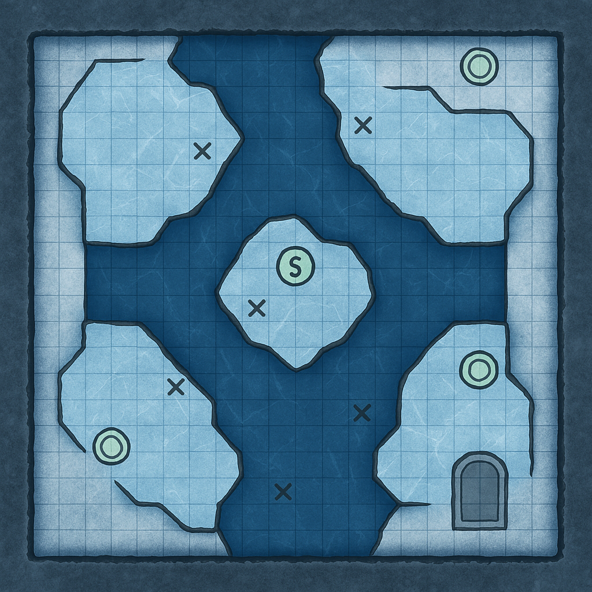

## Intro
Den of the Rat King is a curious place. You've encountered a row of gigantic stone doors, whose halls are decorated with train tracks and whose entrances can only be opened by turning the central turnstile and using the right runic stones on the large doors. With the tools at hand, you've only been able to open the first door, which lead you to ice cold tunnels. 

## Relevant Runestones:
### Sunstone
> **Runic fireball (X is seconds held)**
> When the stone is activated by running a finger along the rune, it will charge until the finger is removed from the stone. A fireblast will appear in a X\*5 feet cone, doing Xd6 damage. Reflex save 20 halves damage.

### Icestone
> **Runic Icesheet (X is seconds held)**
> When the stone is activated by running a finger along the rune, it will charge until the finger is removed from the stone. A one-inch thick sheet of ice as wide as the slab itself appears on either side of the stone. The length of the sheet is 5ft\*X. If the sheet hits a solid object heavier than the slab (and the person holding it), the slab (and it's holder) are pushed backwards at high speed, causing X\*d4 damage on impact, reflex DC 20. The sheet is always able to hold one person. Walking across a horizontal beam of ice requires a DC5 acrobatics. Climbing up a sloped beam is not possible without special equipment. It is possible to remove the disc from the created sheet and take it with you, but creating a new sheet evaporates the old one. 

## Intro fight
> The tunnel exhales a breath of frost as you step through the archway. The air grows heavier, each step dragging at your limbs as though the Abyss itself wants to pin you down. Ahead, the corridor widens into a cavern of ice — jagged walls glittering with pale light, the floor fractured by black chasms filled with freezing water.
> At the center, upon a raised platform, a towering figure awaits you. Almost Yeti like in appearance, this hulking creature is covered in snow-white fur. The only thing not covered in a thick coat is his face, a black, almost ape-like appearance with canines of ivory sticking out of its wide mouth. A greataxe rests across his shoulders, its blade rimed with ice. As his head turns, you hear the crunch of bone and the hiss of breath colder than the grave.
> The Rat King’s voice scratches faintly at the edges of your mind: “Prove yourselves worthy. Survive the storm.”
> The giant steps forward, the ice beneath him cracking like thunder. The chamber itself seems to shudder in anticipation — icicles trembling above, rune‑circles faintly glowing across distant platforms. The test has begun.

## Fight Room 3 - Cold front

Summary: Saumen Kar Monster fight, several platforms, each third turn the platform the players are on is showered with icicles. The monster has DR15, each activated rune (using the disc) removes 5.

**Room Features & Flow**
**1. Platforms & Gaps**
- Ice cold water runs between the ice sheets, too wide to jump in most places.
- Only way to cross quickly is with the Runic Disc

**2. Rune Circles
- Three total, each on a different platform.
- To weaken the Damage Resist on the monster, all three must be activated by shining a **green beam** from the disc into the matching wall rune.
- Players must reposition during the fight to hit each one.

**3. Hazards
- Every 3 rounds, an **icicle barrage** drops in one of these zones (Reflex DC 18 half, 3d6 piercing + 1d6 cold).
- Forces movement and discourages turtling.

**4. Saumen Kar
- Starts on the central platform, using **wall of ice** to block direct routes.
- Will leap gaps, smash ice beams, and use knockback to push PCs into chasms.

___
___
**Saumen Kar; CN Large monstrous humanoid**
**Init** +2; **Senses** darkvision 60 ft., scent; Perception +21  

---
**DEFENSE**  
**AC** 24, touch 11, flat‑footed 22 (+4 deflection, +2 Dex, +9 natural, –1 size)  
**hp** 350 (13d10+65): 142
Polar bear: 29
**Fort** +11, **Ref** +10, **Will** +9  
**Defensive Abilities** frostbite brands; **Immune** cold; **Resist** fire 20; DR 10

---

**OFFENSE**  
**Speed** 40 ft.  
**Melee** greataxe +21/+16/+11 (2d6+12/19–20 plus 1d6 cold and 1d6 lighting), headbutt +15 (1d6+4 plus stun)  
**Space** 10 ft.; **Reach** 10 ft.  
**Special Attacks** snowstorm (2d6 cold + 2d6 slashing, DC 24), stun (1 round, DC 24)  
Takes an extra counter off the icicles
**Spell‑Like Abilities** (CL 13th; concentration +13)  
- 3/day — *wall of ice* (DC 14)  -> spent 1
- 1/day — *summon nature’s ally VI* (polar bear or dire bear only)  -> spent all

---

**STATISTICS**  
**Str** 26, **Dex** 15, **Con** 20, **Int** 11, **Wis** 12, **Cha** 11  
**Base Atk** +13; **CMB** +22; **CMD** 38  
**Feats** Alertness, Diehard, Endurance, Great Fortitude, Improved Critical (greataxe), Self‑Sufficient, Weapon Focus (greataxe)  
**Skills** Heal +3, Knowledge (nature) +13, Perception +21, Sense Motive +3, Stealth +14 (+18 in ice/snow), Survival +21  
**Languages** Giant  
**Racial Modifiers** +4 Stealth in ice and snow  

---

**SPECIAL ABILITIES**  
**Frostbite Brands (Ex)** — Brands infuse the saumen kar with intense cold, granting fire resistance 20 and adding 1d6 cold damage to all melee attacks.  
**Snowstorm (Su)** — Functions like *whirlwind*, but deals 2d6 cold + 2d6 slashing damage and imposes –20 Perception within the area; fly speed 40 ft. (perfect) in this form.  
**Stun (Ex)** — A creature struck by the headbutt must succeed at a DC 24 Fort save or be stunned for 1 round.  

## Rewards:
- Boots of speed
- Stormstone (Teiwar rune)
- Rat King's Coin
- Bottle of Abyssal Echoes

### Stormstone
> **Runic Stormlash (X is seconds held)**  
> When the stone is activated by running a finger along the rune, it will charge until the finger is removed from the stone. On release, a crackling bolt of lightning arcs outward in a straight line, 5 ft wide and X×10 ft long, dealing Xd6 electricity damage. Reflex DC 20 halves damage.  
>  
> **Secondary Effect:** The discharge generates a violent gust of wind (as *gust of wind*, CL 8), pushing creatures and scattering loose objects in the path of the lightning. Flying creatures must make a DC 20 Fly check or be blown back 1d4×5 ft.  
>  
> **Environmental Interaction:** The lightning automatically arcs to any conductive surface (metal rails, water, etc.), extending its reach by 10 ft per conductive link. If the bolt passes through water, all creatures within 5 ft of the water take half damage (Reflex DC 20 halves again).

### Rat King’s Coin
- *Slotless wondrous item*  
- A tarnished silver coin etched with ten rat tails knotted together.  
- **Effect:** Once per day, flip the coin.  
  - On heads: gain a +2 luck bonus to attack rolls for 1 minute.  
  - On tails: suffer a –2 penalty to AC for 1 minute.  
- **Flavor:** The Rat King “tests” worthiness with chance.

---

### Bottle of Abyssal Echoes
- *Slotless, consumable*  
- A black glass bottle filled with whispering mist.  
- **Effect:** When uncorked, the mist fills a 20‑ft radius for 3 rounds.  
  - All creatures inside must succeed at a DC 18 Will save or hear voices of their future selves, suffering **confusion** for 1 round.  
- **Flavor:** The mist ties into the campaign’s theme of time‑displaced versions of the heroes.

